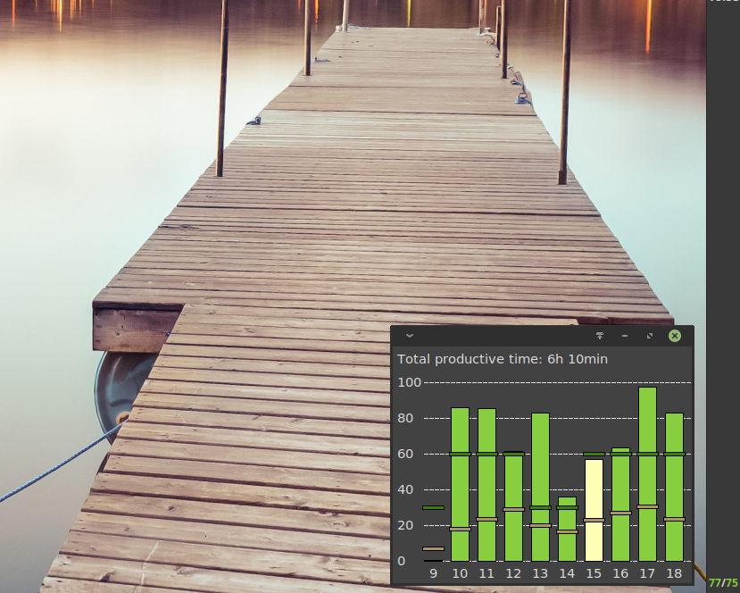

# About

This script provides a Rescuetime applet for xfce4 panels. The applet displays total productive time during the last 30 minutes and the share of total productive time in total logged over the current day in the panel. It provides some additional statistics about daily productivity in a simple GUI when clicked.

 <!-- .element width="25%" -->

# Setup

1. Install xfce4-genmon-plugin
2. Add generic monitor instance to your panel
3. Clone repository, make sure app.py and chart.py are executable
4. Create Rescuetime API key here: https://www.rescuetime.com/anapi/manage
5. Point generic monitor instance to ./app.py
6. Enter API key when prompted

# Configuration

The applet can be configured using a json file stored in ~/.config/xfce4-genmon-rescuetime/settings.

__Note:__ The premium version of Rescuetime updates user data every three minutes, while the free version updates only every 30 minutes. As a result, current productivity will usually not be up-to-date for users with a free Rescuetime account.
